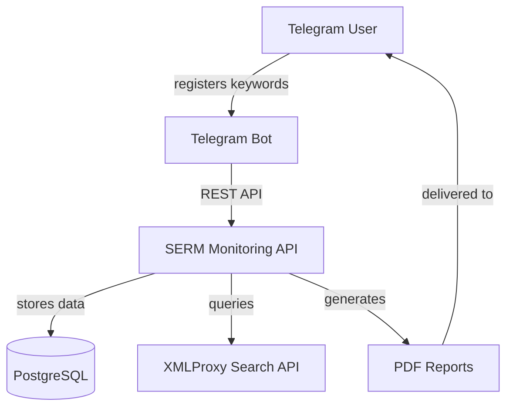
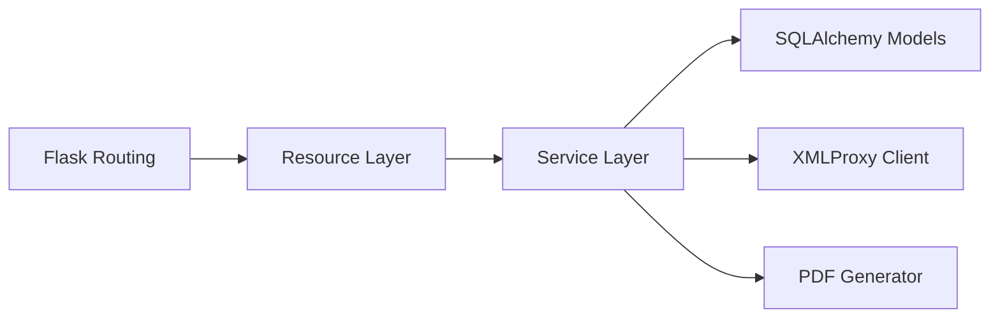

# SERM Monitoring – C4 Architecture Model

This document captures the primary structures and interactions of the SERM Monitoring platform using the C4 modelling approach.

## Level 1 – System context



* The **Telegram user** interacts exclusively through the Telegram bot.
* The **Telegram bot** forwards structured requests to the HTTP API.
* The **SERM Monitoring API** persists state in PostgreSQL and integrates with XMLProxy for search results.
* Generated **PDF reports** are shared back with the user.

## Level 2 – Container diagram

```mermaid
graph TB
    subgraph Client
        TB[Telegram Bot (Aiogram)]
    end

    subgraph Server
        API[Flask REST API]
        Worker[Background Tasks]
    end

    subgraph Data
        DB[(PostgreSQL)]
        Reports[(Report Storage)]
    end

    API --> DB
    API --> Reports
    API --> XMLProxy[(XMLProxy Search Service)]
    TB --> API
    Worker --> API
    Worker --> Reports
```

* The **Flask REST API** exposes `/api` endpoints and orchestrates business logic.
* **Background tasks** (future extension) can trigger scheduled monitoring runs reusing the service layer.
* **PostgreSQL** stores users and keyword relationships.
* **Report storage** keeps generated PDFs on disk or object storage.

## Level 3 – Component diagram (API container)



* **Resource layer (`api.py`)** validates requests with Marshmallow and shapes HTTP responses.
* **Service layer (`services.py`)** implements business rules such as keyword management and search orchestration.
* **SQLAlchemy models (`models/models.py`)** provide persistence abstractions.
* **Integrations (`xmlproxy.py`)** wrap the external XMLProxy API.
* **PDF generation (`pdf_loader.py`)** produces monitoring reports.

## Level 4 – Code level notes

* Reusable helpers are exposed via `services.__all__` to keep import surfaces tidy.
* The application factory in `__init__.py` centralises configuration and resource registration.
* Each resource validates JSON payloads with `marshmallow` schemas to ensure consistent error handling.
* Reports are written to the `reports/` directory and follow a predictable `<name>_<surname>_<telegram_id>.pdf` naming convention.

## Future enhancements

* Introduce scheduled monitoring runs using Celery or RQ workers.
* Persist generated report metadata inside PostgreSQL.
* Add authentication and role-based access control for administrative dashboards.
